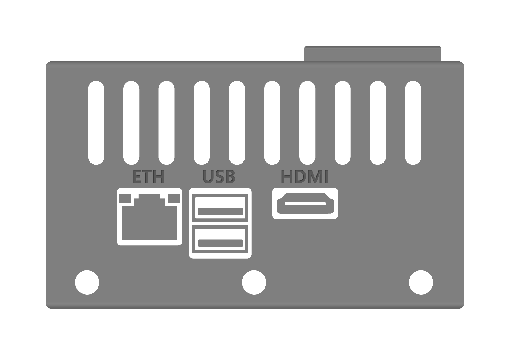
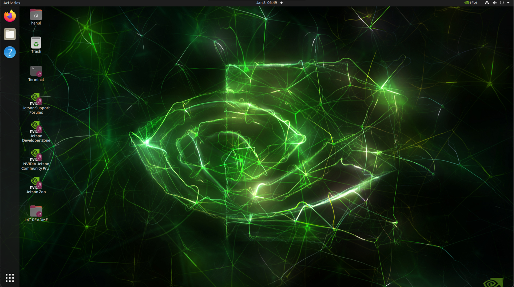
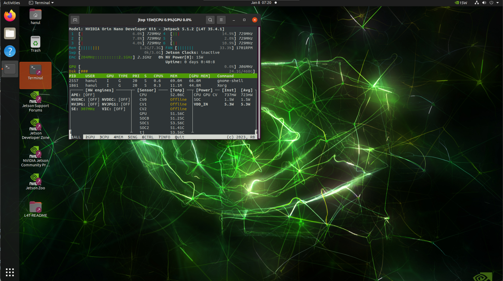

## EmVision에서 개발 시작하기

### 필요한 장치 및 케이블

- EmVision 개발 플랫폼 본체
- HDMI 포트를 지원하는 모니터와 HDMI 케이블
- USB 연결을 지원하는 키보드와 마우스
- 전원공급장치 및 전원 케이블
- 네트워크 케이블(UTP 케이블) *

> 안드로이드 스마트폰을 사용하는 경우 USB 테더링을 이용해서 네트워크 접속이 가능합니다.

### 주변 장치 연결하기

1. **ETH** 포트에 공유기와 연결되어 있는 UTP 케이블을 연결합니다.
1. **HDMI** 포트에 모니터와 HDMI 케이블을 연결합니다.
1. **USB** 포트에 키보드와 마우스를 연결합니다.
1. 장치와 연결한 모니터의 전원을 켭니다.
1. 전원 케이블을 **PWR** 포트에 연결합니다.

> EmVision은 전원 케이블을 연결하는 즉시 냉각팬이 동작하면서 부팅을 시작합니다. 만약 전원 케이블을 연결했는데 부팅이 시작되지 않는 경우 다음 조치를 시도해 볼 수 있습니다.
>
> 1. 전원이 정격전력(약 25W)을 안정적으로 공급하고 있는지 확인합니다.
> 1. 전원 케이블을 분리한 후 10초 정도 기다린 후 전원 케이블을 다시 연결합니다.

### EmVision 초기화면

부팅 완료 후 보이는 모니터 화면입니다. 여기서부터는 Ubuntu 20.04와 동일한 방식으로 사용하실 수 있습니다.

### Jetson Stats 실행

터미널에서 `jtop`을 실행하면 Jetson Stats가 실행됩니다.
Jetson Stats는 키보드 및 마우스를 사용하여 제어할 수 있습니다.
Jetson Stats는 EmVision의 CPU, GPU, 메모리, 전력 소비 등의 상태를 실시간으로 모니터링할 수 있는 도구입니다.
또한, CTRL 탭을 선택하여 팬 사용 정책 및 전력 모드 설정을 수행할 수 있습니다.
