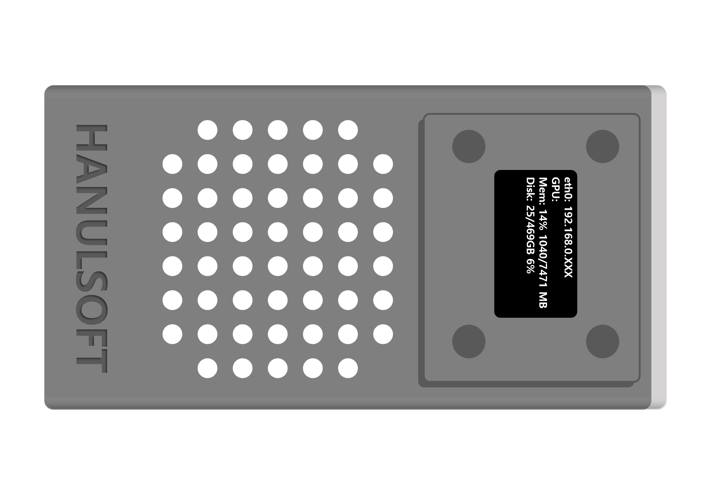

## 개발용 PC와 연결해서 원격 개발 시작하기

### 필요한 장치

- 개발용 PC
- 네트워크로 연결한 EmVision
  - 공유기를 이용해 내부 네트워크에 연결
  - Micro USB 케이블을 이용해서 개발용 PC와 연결

### 개발용 PC에서 SSH 접속하기

{:width="50%"}

- EmVision을 내부 네트워크에 연결한 경우 상단 LCD에 표시되는 IP 주소를 이용해서 개발용 PC에서 SSH 접속
- EmVision을 Micro USB 케이블을 이용해서 연결하는 경우 개발용 PC와 연결한 후 외장디스크를 인식하면 개발용 PC에서 `192.168.551.1`로 접속
- 개발용 PC에서 터미널을 열고 다음 명령어를 입력

```bash
# 내부 네트워크에 연결한 경우
ssh hanul@192.168.XXX.XXX
# Micro USB 케이블을 이용해서 연결한 경우
ssh hanul@192.168.55.1
```

- 비밀번호는 `hanul`로 입력

### VNC 사용하기

VNC를 이용하면 개발용 PC에서 EmVision의 화면을 볼 수 있습니다.
EmVision은 리소스 절약을 위해 HDMI이 없는 경우 GUI 환경을 실행하지 않습니다.
따라서 HDMI로 모니터를 연결하지 않은 경우 VNC를 연결하면 NVIDIA 로고만 표시됩니다.

HDMI에 모니터를 연결한 경우에는 다음 명령어를 입력해서 VNC를 실행합니다.

```bash
# VNC 서버인 vino의 기본 설정
gsettings set org.gnome.Vino prompt-enabled false
gsettings set org.gnome.Vino require-encryption false
# vino-server 실행
DISPLAY=:0 /usr/lib/vino/vino-server
```

HDMI에 모니터를 연결하지 않은 경우는 [TigerVNC](https://tigervnc.org/)를 이용해서 VNC 서버를 실행합니다.

> TigerVNC를 이용해서 VNC를 사용하는 방법은 추후 업데이트 예정입니다.
> 기존 VINO 서버에 디스플레이를 직접 할당하는 방법에 비해 훨씬 간단하며 모니터가 없는 경우에도 VNC를 사용할 수 있는 TigerVNC의 일반적인 사용법을 소개할 예정입니다.
