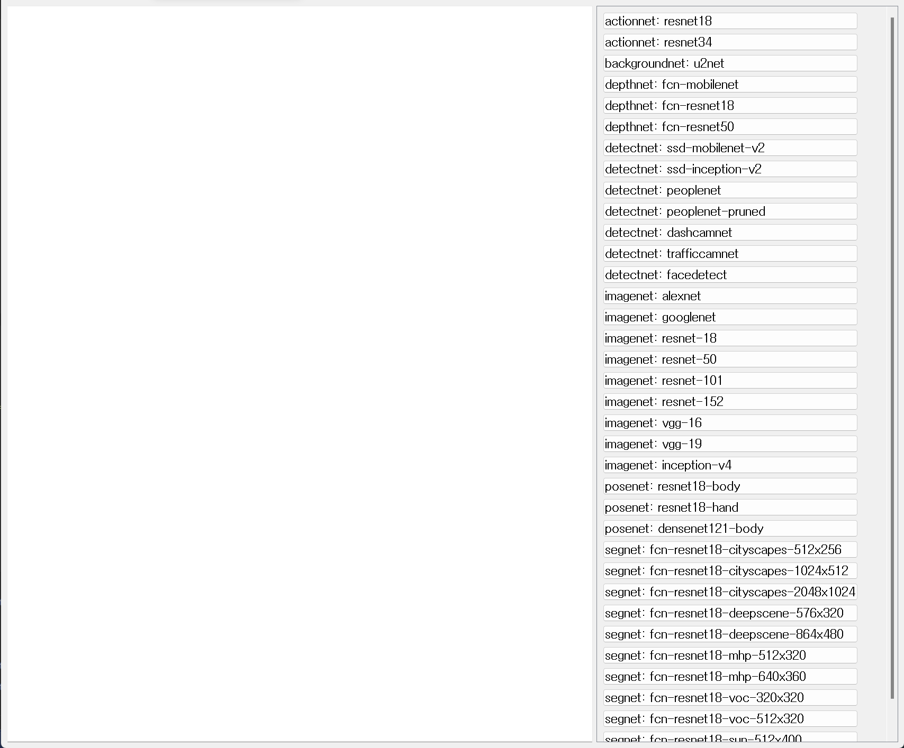

## 데모 앱 실행하기

### 추론 파이프라인 데모 앱 실행하기

Python3를 이용해서 사전에 설치되어있는 [Jetson Inference](https://github.com/dusty-nv/jetson-inference)의 데모를 실행하는 파이프라인을 제공합니다.

```bash
cd ~/jetson-Demos
python3 app.py
```

{: width="30%"}

버튼을눌러 각 파이프라인을 수행할 수 있습니다.

- **actionnet** : 행동 분류 모델
- **backgroundnet** : 배경 제거 모델
- **depthnet** : 깊이 인식 모델
- **detectnet** : 객체 탐지 모델
- **imagenet** : 이미지 분류 모델
- **posenet** : 포즈 인식 모델
- **segnet** : 시맨틱 세그멘테이션 모델
