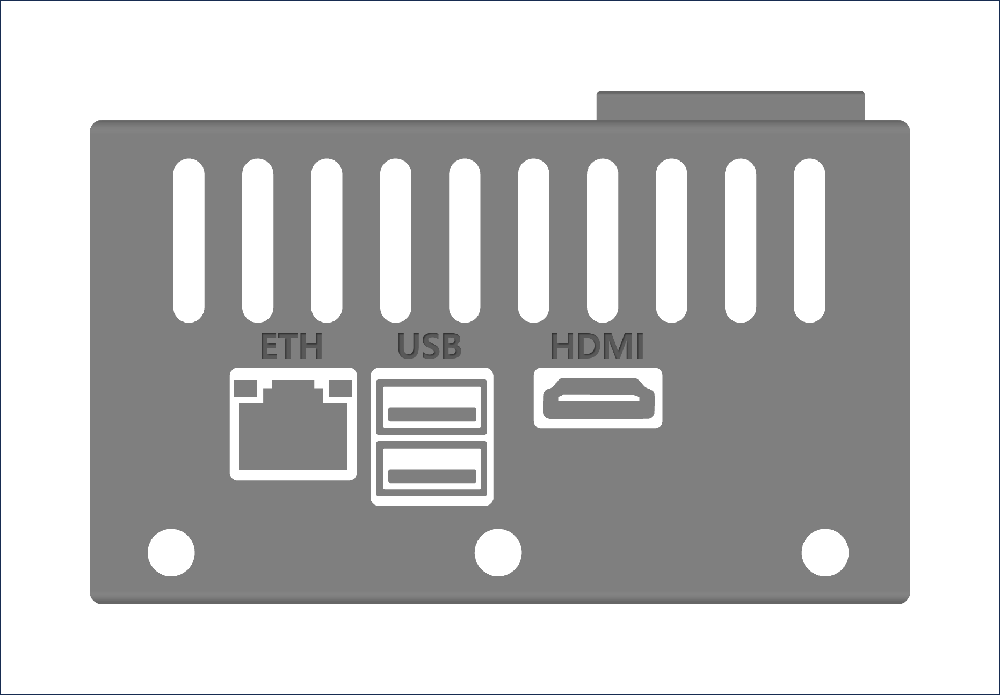
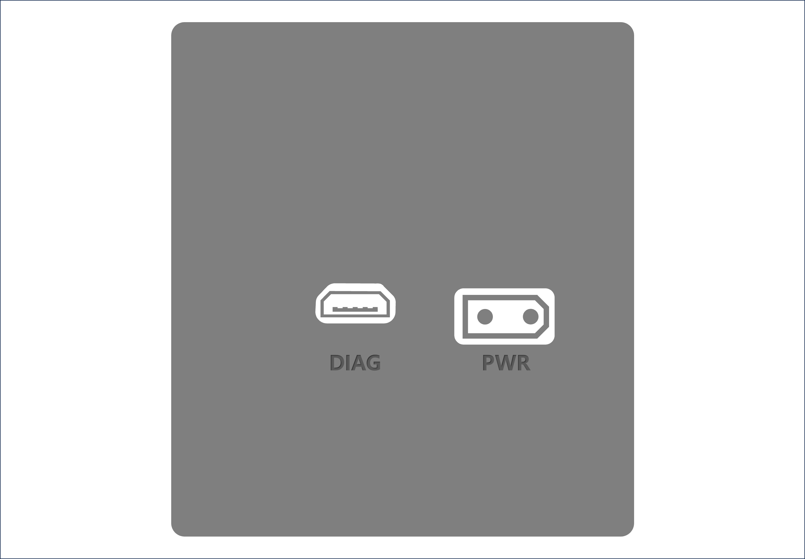

# EmVision 시작하기

## EmVision에서 개발 시작하기

### 필요한 장치 및 케이블

- EmVision 개발 플랫폼 본체
- HDMI 포트를 지원하는 모니터와 HDMI 케이블
- USB 연결을 지원하는 키보드와 마우스
- 전원공급장치 및 전원 케이블
- 네트워크 케이블(UTP 케이블) <sup style="color: var(--ui-mark-color)">*</sup>

> 안드로이드 스마트폰을 사용하는 경우 USB 테더링을 이용해서 네트워크 접속이 가능합니다.

### 주변 장치 연결하기

{:width="50%"}

1. **ETH** 포트에 공유기와 연결되어 있는 UTP 케이블을 연결합니다.
1. **HDMI** 포트에 모니터와 HDMI 케이블을 연결합니다.
1. **USB** 포트에 키보드와 마우스를 연결합니다.
1. 장치와 연결한 모니터의 전원을 켭니다.

{:width="50%"}

1. 전원 케이블을 **PWR** 포트에 연결합니다.
{:start="5"}

> EmVision은 전원 케이블을 연결하는 즉시 냉각팬이 동작하면서 부팅을 시작합니다. 만약 전원 케이블을 연결했는데 부팅이 시작되지 않는 경우 다음 조치를 시도해 볼 수 있습니다.
>
> 1. 전원이 정격전력(약 25W)을 안정적으로 공급하고 있는지 확인합니다.
> 1. 전원 케이블을 연결한 후 10초 정도 기다린 후 전원 케이블을 분리한 후 다시 연결합니다.

## 개발용 PC와 연결해서 원격 개발 시작하기

### 필요한 장치

- (추천) [비주얼 스튜디오 코드](https://code.visualstudio.com/)를 설치합니다.
- (옵션 1) 개발용 호스트 PC가 동일한 네트워크에 연결되어 있도록 네트워크 구성
- (옵션 2) Micro USB 케이블을 사용하여 EmVision과 개발용 호스트 PC를 연결


### 개발용 PC에서 SSH 접속하기

- EmVision을 내부 네트워크에 연결한 경우(옵션 1) 상단 LCD에 표시되는 IP 주소를 이용해서 개발용 PC에서 SSH 접속을 합니다.
- EmVision을 Micro USB 케이블을 이용해서 연결하는 경우(옵션 2) 개발용 PC와 연결한 후 외장디스크를 인식하면 개발용 PC에서 `192.168.55.1`로 SSH 접속을 합니다.

### VNC 사용하기

- **디스플레이 `:0`이 존재하는 경우**: HDMI에 모니터를 연결한 경우

```bash
gsettings set org.gnome.Vino prompt-enabled false
gsettings set org.gnome.Vino require-encryption false
DISPLAY=:0 /usr/lib/vino/vino-server
```
